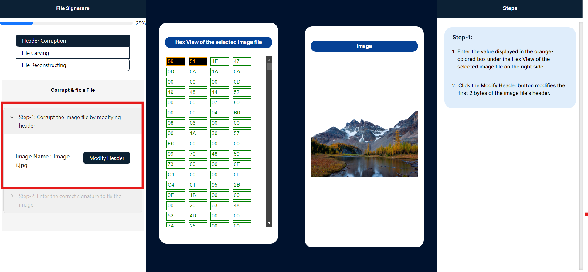
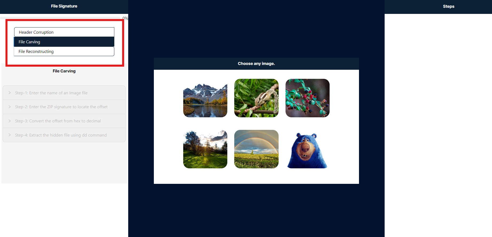
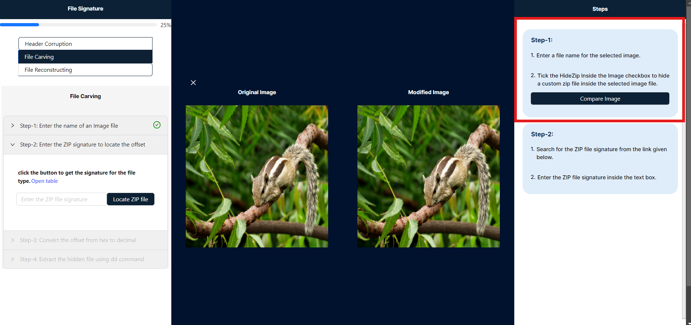
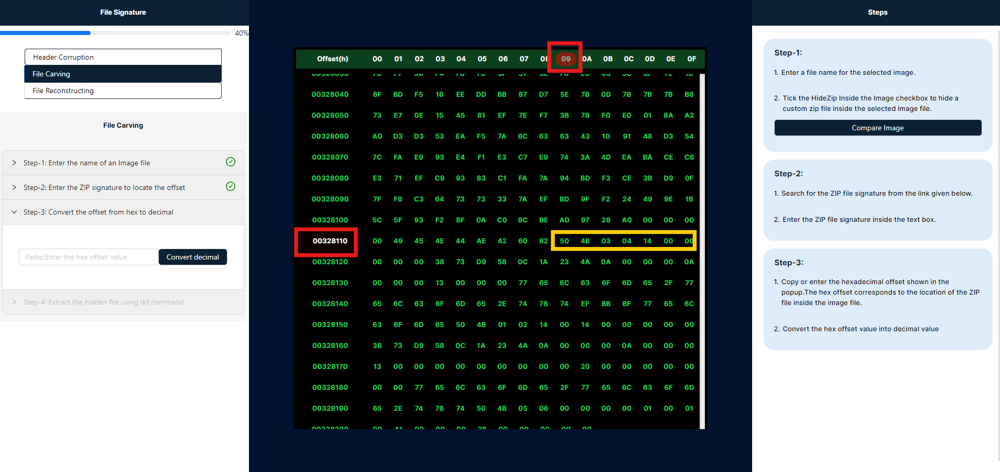
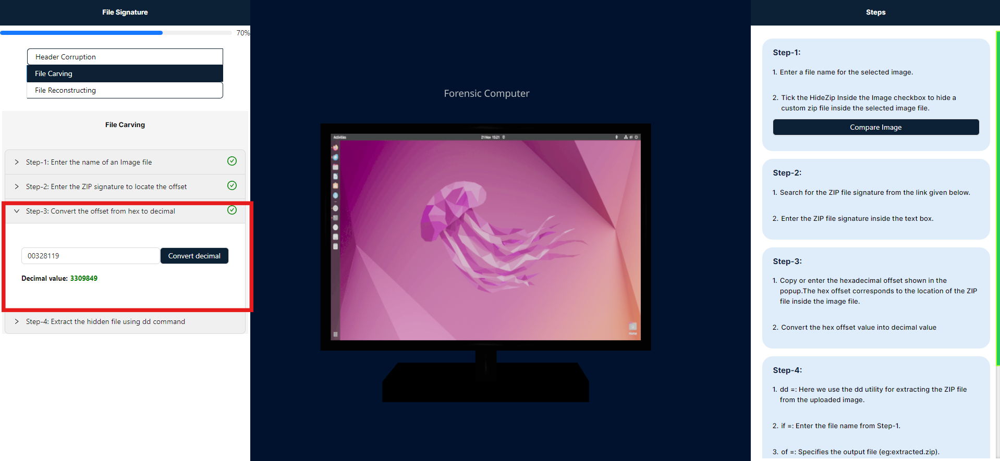
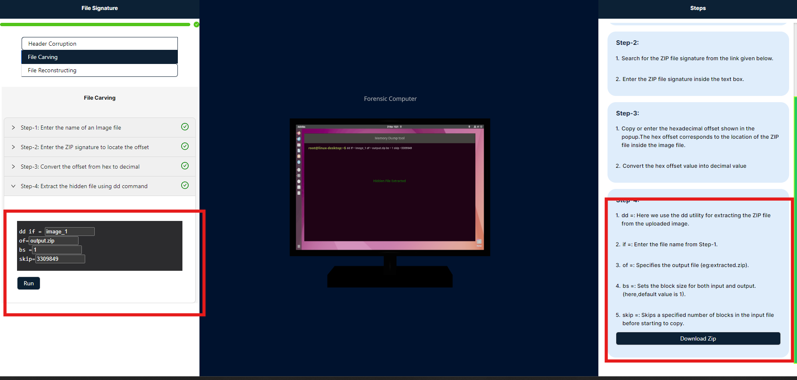
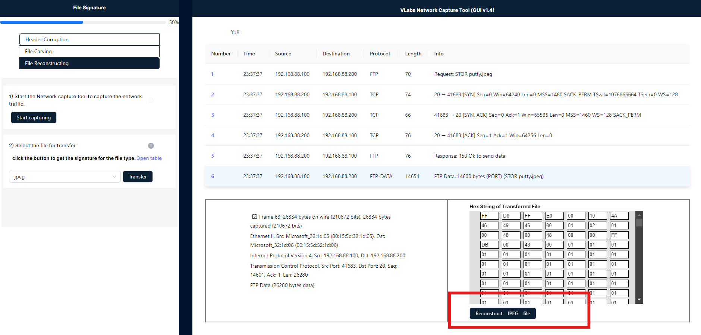

# Procedure

A file signature, also known as a magic number, is a unique sequence of bytes at the beginning of a file that identifies the file type. It helps operating systems and applications determine how to handle and process the file. File signatures are crucial in digital forensics for recognizing and categorizing files accurately, even if their extensions have been altered.

Below, you can see an image with a red box highlighting three options in the header: Header Corruption, File Carving, and File Reconstructing. To proceed to the Header Corruption simulation, please click on the "Header Corruption" option.

### Header Corruption

Header corruption changes the file signature, which is a unique sequence of bytes identifying a file's format. This alteration can make it impossible for software to correctly recognize or open the file.

1. **To proceed, please click to select any image highlighted in red. Once an image is selected, only Step 1 will be enabled and will expand automatically:**

2. **On the right side panel labeled "Steps," you will find detailed instructions to guide you through this simulation:**

3. **The center of the panel serves as the primary workspace in this simulation, showcasing two key elements: the selected image's hexadecimal string and its corresponding visual representation:**

4. **To modify the file signature, enter the bytes highlighted in black and orange within the Hex View of the selected image file panel. Ensure that the values are within the hexadecimal range of 0-9 and A-F. After inputting the new 2-byte values, click the "Modified Image" button to apply the changes:**

5. **After clicking the "Modified Image" button, the image has become corrupted. The input box for entering strings is now displayed in red, and the image panel shows the corrupted image. To view the corrupted image, you can download it from the "Steps" panel:**

6. **After corrupting the image, proceed to Step 2, where you will find a table listing file signatures for various types, including JPG, PNG, EXE, and ZIP. Enter the correct 2-byte file signature corresponding to the selected file type in the simulation. To repair the corrupted image, click the Fix button. (Note: Expand Step 1 to view the image type.):**

### File Carving

File carving is a technique used to recover files from disk images by identifying and extracting file structures. To hide a ZIP file inside an image, the ZIP file's data is embedded within the image file's structure, often in the least significant bits of pixel data or as additional bytes appended to the image file. This method makes the ZIP file less noticeable and harder to detect by casual inspection. When someone extracts the hidden data, they can reveal the embedded ZIP file.

1. **To proceed, please click to select any image highlighted in red. Once an image is selected, only Step 1 will be enabled and will expand automatically:**

2. **On the right side panel labeled "Steps," you will find detailed instructions to guide you through this simulation:**

3. **To conceal the text file, first enter the text that you wish to hide within the image. Then, select the "Hide to Zip" checkbox to compress the text file into a ZIP archive and embed it within the image. Finally, click the "Hide" button to proceed with the next step.:**

4. **Click the "Compare Image" button in the steps panel to compare the original image with the modified image, in which the ZIP file has been concealed.**

5. **In the center of the simulation, you will find the Hex tool, which displays the selected image and conceals the hexadecimal strings of ZIP files. In Step 2, you are required to enter the ZIP file signature from the signature table into the provided text input field. By clicking the "Locate File" button, the tool will identify and display the corresponding hexadecimal value of the ZIP file.:**

6. **After clicking the "Locate Zip File" button, the hex tool will display the file signature highlighted in yellow and its corresponding offset highlighted in red.:**

7. **Copy or enter the hexadecimal offset displayed in the popup. This hexadecimal offset represents the location of the ZIP file within the image file. After entering the offset, click "Convert" to transform it into a decimal value.:**

7. **This step involves extracting a hidden ZIP file embedded within an image, allowing for the recovery of concealed data that is integrated into the image file.:**

The `dd` command is used for low-level copying and conversion of files. Here's a breakdown of its components:

- **if=**: Specifies the input file. Enter the name of the source file from which data will be read.
- **of=**: Specifies the output file. For example, `extracted.zip` would be the file where the extracted data is written.
- **bs=**: Defines the block size for reading and writing. A block size of `1` means that the command will process data one byte at a time.
- **skip=**: Tells `dd` to skip a specified number of blocks from the beginning of the input file before starting to copy. This is useful for locating data at a specific offset.

7. **After executing the command, the ZIP file will be created exactly as specified. To view the ZIP file, please click the "Download" button in the steps panel, which I have highlighted in red.:**

### File Reconstruction

File reconstruction in Wireshark involves analyzing network traffic to reassemble files from captured packets. Wireshark captures and displays packet data, which can include file fragments. By using Wireshark's file reconstruction tools, you can identify and extract these fragments, reconstructing the original file by piecing together the captured data. This process helps in recovering files from network traffic for analysis or forensic purposes.

1. **In this simulation, an employee attempts to share confidential files, such as JPG, PNG, EXE, or ZIP formats, with an external party. These actions are monitored and recorded by an administrative capture tool known as the VLabs Capture Tool. Let’s begin the exercise.**
2. **Please click the "Start Capturing" tool to begin recording the actions transmitted by the employee.**

3. **After that, select the file type from the dropdown menu and click the "Transfer" button. An animation will indicate the file transfer process to an external location. In the admin panel, click on the highlighted red square to open the capturing tool.:**

4. **In the image below, you will see a capturing tool with a search box. Enter the file signature provided in Step 2 into this search box. Once the file signature is entered, the corresponding pocket key will be highlighted in light blue. Below this, you will find a table; under the table, click the "Reconstruction File" button to generate the download option.**

5. **The download option will be located in the left panel below. You can click on it to download the image sent by the employee.:**

